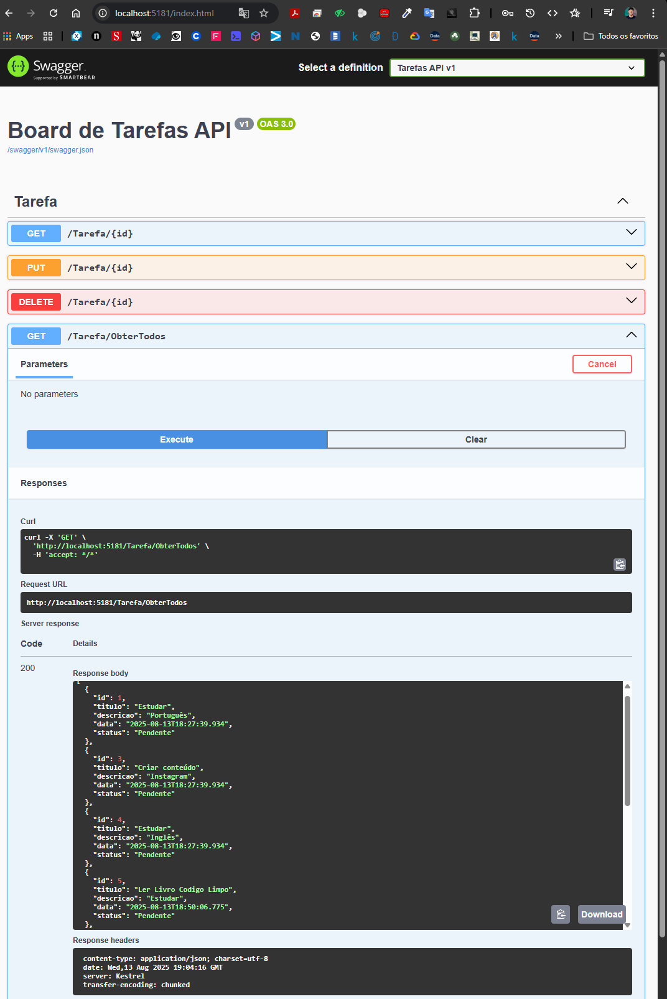
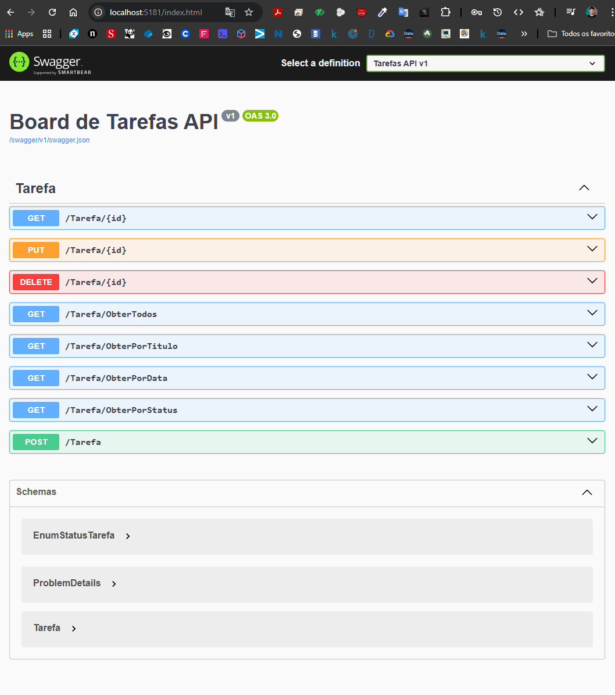

# 📋 API de Gerenciamento de Tarefas - Trilha .NET DIO


## 🎯 Visão Geral

Este projeto é uma **API RESTful completa** para gerenciamento de tarefas, desenvolvida como parte da **ootcamp Avanade - Back-end com .NET e IA**. A aplicação implementa operações CRUD completas com Entity Framework, documentação automática via Swagger e arquitetura baseada em boas práticas de desenvolvimento.

## ⚡ Funcionalidades Implementadas

### 📝 Operações CRUD Completas
- ✅ **Criar tarefa** - Endpoint para criação de novas tarefas
- ✅ **Listar todas as tarefas** - Recuperação de todas as tarefas cadastradas
- ✅ **Buscar por ID** - Consulta específica de tarefa por identificador
- ✅ **Atualizar tarefa** - Modificação completa de tarefas existentes
- ✅ **Deletar tarefa** - Remoção de tarefas do sistema

### 🔍 Consultas Especializadas
- ✅ **Filtrar por título** - Busca de tarefas por fragmento do título
- ✅ **Filtrar por data** - Consulta de tarefas por data específica
- ✅ **Filtrar por status** - Listagem por status (Pendente/Finalizada)

### 📊 Validações e Regras de Negócio
- ✅ **Validação de data obrigatória** - Não permite criação sem data
- ✅ **Controle de status** - Enum para Pendente/Finalizada
- ✅ **Respostas HTTP padronizadas** - Códigos de status apropriados
- ✅ **Tratamento de erros** - Respostas consistentes para cenários inválidos

## 🏗️ Estrutura do Projeto

```
TrilhaApiDesafio/
├── 📁 Context/
│   └── OrganizadorContext.cs          # DbContext do Entity Framework
├── 📁 Controllers/
│   └── TarefaController.cs            # Controller principal da API
├── 📁 Models/
│   ├── Tarefa.cs                      # Modelo de dados da tarefa
│   └── EnumStatusTarefa.cs            # Enum para status das tarefas
├── 📁 Migrations/
│   ├── InitialCreate.cs               # Migration inicial do banco
│   └── OrganizadorContextModelSnapshot.cs
├── 📁 Properties/
│   └── launchSettings.json            # Configurações de execução
├── 📁 wwwroot/
│   └── images/                        # Pasta para arquivos estáticos
├── 📁 prints/                         # Capturas de tela do projeto
├── Program.cs                         # Configuração principal da aplicação
├── appsettings.json                   # Configurações da aplicação
└── README.md                          # Documentação do projeto
```

## 🎯 Regras de Negócio

### 📋 Modelo de Tarefa
- **ID**: Identificador único autoincremental
- **Título**: Texto descritivo da tarefa (opcional)
- **Descrição**: Detalhamento da tarefa (opcional)
- **Data**: Data da tarefa (obrigatória)
- **Status**: Enum com valores Pendente (0) ou Finalizada (1)

### ⚖️ Validações Implementadas
1. **Data obrigatória**: Retorna BadRequest (400) se data não informada
2. **ID válido**: Retorna NotFound (404) para IDs inexistentes
3. **Busca por título**: Utiliza busca parcial (LIKE) case-insensitive
4. **Filtro por data**: Compara apenas a data, ignorando horário
5. **Status válido**: Aceita apenas valores do enum (0 ou 1)

## 🛠️ Boas Práticas Implementadas

### 🏛️ Arquitetura
- ✅ **Padrão MVC** - Separação clara de responsabilidades
- ✅ **Dependency Injection** - Injeção de dependência nativa do .NET
- ✅ **Entity Framework Code First** - Modelagem orientada a código
- ✅ **Migrations** - Controle de versão do banco de dados

### 📝 Documentação
- ✅ **Swagger/OpenAPI** - Documentação automática e interativa
- ✅ **XML Comments** - Documentação detalhada dos endpoints
- ✅ **Responses padronizadas** - Status codes apropriados

### 🔧 Configuração
- ✅ **appsettings.json** - Configurações externalizadas
- ✅ **Environment específico** - Configurações por ambiente
- ✅ **CORS habilitado** - Pronto para frontend
- ✅ **Static Files** - Suporte a arquivos estáticos

## 🚀 Tecnologias Utilizadas

### 🎨 Framework e Runtime
- **.NET 9.0** - Framework principal
- **ASP.NET Core** - Framework web
- **C#** - Linguagem de programação

### 🗄️ Banco de Dados
- **Entity Framework Core 9.0** - ORM
- **SQLite** - Banco de dados local
- **Code First Migrations** - Controle de schema

### 📚 Documentação e Testes
- **Swagger/OpenAPI 9.0** - Documentação automática
- **Swashbuckle** - Geração de interface Swagger

### 🛠️ Ferramentas de Desenvolvimento
- **Visual Studio Code** - IDE
- **Git** - Controle de versão
- **NuGet** - Gerenciamento de pacotes

## 🖥️ Demonstração do Sistema

### 📸 Interface Swagger - CRUD Completo

O sistema possui uma interface completa do Swagger acessível em `http://localhost:5181` com todos os endpoints implementados:





### 🔗 Endpoints Disponíveis

| Método | Endpoint | Descrição |
|--------|----------|-----------|
| `GET` | `/Tarefa` | Lista todas as tarefas |
| `GET` | `/Tarefa/{id}` | Busca tarefa por ID |
| `POST` | `/Tarefa` | Cria nova tarefa |
| `PUT` | `/Tarefa/{id}` | Atualiza tarefa existente |
| `DELETE` | `/Tarefa/{id}` | Remove tarefa |
| `GET` | `/Tarefa/ObterPorTitulo/{titulo}` | Busca por título |
| `GET` | `/Tarefa/ObterPorData/{data}` | Busca por data |
| `GET` | `/Tarefa/ObterPorStatus/{status}` | Busca por status |

### 📝 Exemplo de Payload

```json
{
  "titulo": "Implementar API de Tarefas",
  "descricao": "Desenvolver todos os endpoints necessários",
  "data": "2025-08-13T10:00:00",
  "status": 0
}
```

## 🚀 Como Executar

### 📋 Pré-requisitos
- .NET 9.0 SDK instalado
- Visual Studio Code ou Visual Studio
- Git (opcional)

### 🔧 Passos para Execução

1. **Clone o repositório**
```bash
git clone https://github.com/ItaloRochaj/api-net-desafio-avanade.git
cd api-net-desafio-avanade
```

2. **Restaure as dependências**
```bash
dotnet restore
```

3. **Execute as migrations**
```bash
dotnet ef database update
```

4. **Execute a aplicação**
```bash
dotnet run --project TrilhaApiDesafio.csproj
```

5. **Acesse a aplicação**
- Swagger UI: `http://localhost:5181`
- API: `http://localhost:5181/Tarefa`
- HTTPS: `https://localhost:7295`

### ⚡ Execução Rápida
```bash
# Para desenvolvimento rápido (sem rebuild)
dotnet run --project TrilhaApiDesafio.csproj --no-build
```

## 🎯 Principais Características

### 🔥 Performance
- ✅ **Entity Framework Otimizado** - Consultas eficientes
- ✅ **SQLite Local** - Inicialização rápida
- ✅ **Migrations Automáticas** - Criação de banco simplificada

### 🛡️ Robustez
- ✅ **Tratamento de Erros** - Respostas consistentes
- ✅ **Validações Completas** - Entrada de dados segura
- ✅ **Status Codes Apropriados** - RESTful compliance

### 🎨 Usabilidade
- ✅ **Swagger Interativo** - Testes diretos na interface
- ✅ **Documentação Completa** - Endpoints autodocumentados
- ✅ **Exemplos Práticos** - Payloads de exemplo

### 🔧 Manutenibilidade
- ✅ **Código Limpo** - Padrões de nomenclatura consistentes
- ✅ **Separação de Responsabilidades** - Arquitetura MVC
- ✅ **Configuração Externa** - Settings em arquivos JSON

## 📈 Melhorias Futuras

- 🔄 Implementação de paginação
- 🔐 Sistema de autenticação e autorização
- 📊 Logging estruturado
- 🧪 Testes unitários e de integração
- 🐳 Containerização com Docker
- ☁️ Deploy em cloud providers

## 👨🏻‍💻 Autor

**Ítalo Rocha**
- 🌐 GitHub: [@ItaloRochaj](https://github.com/ItaloRochaj)
- 💼 LinkedIn: [https://www.linkedin.com/in/italorochaj/]

---

## 📄 Licença

Este projeto foi desenvolvido como parte do **Bootcamp Avanade - Back-end com .NET e IA**.